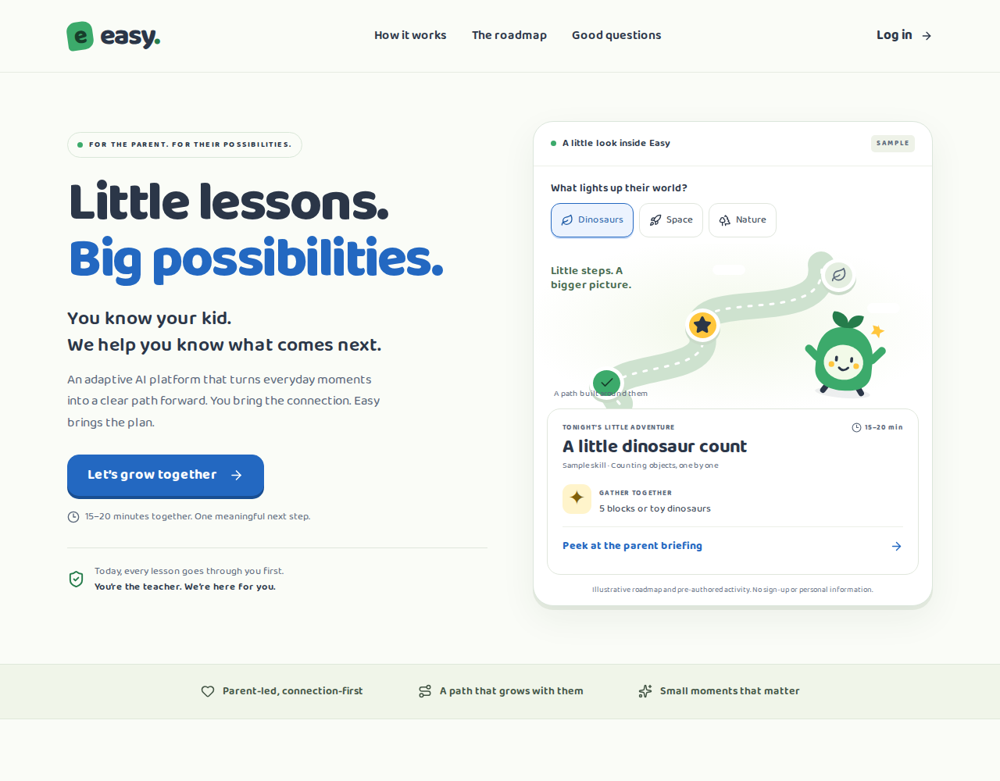
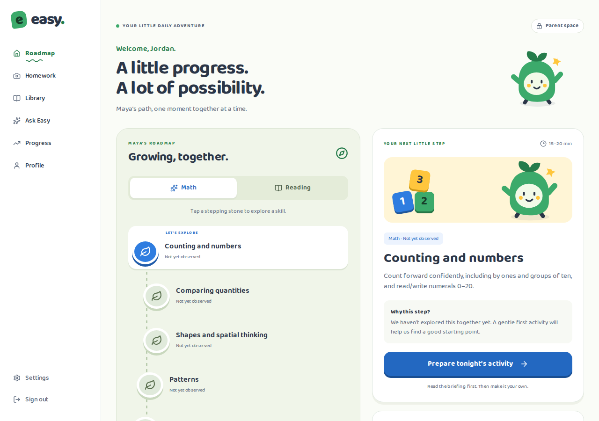
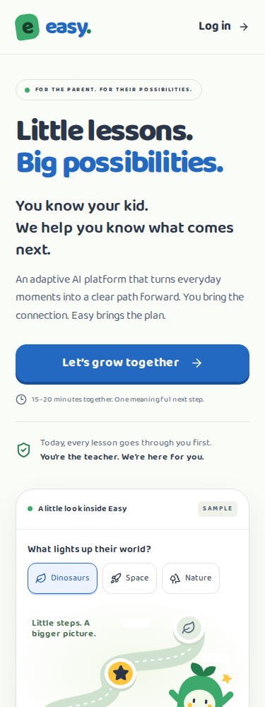
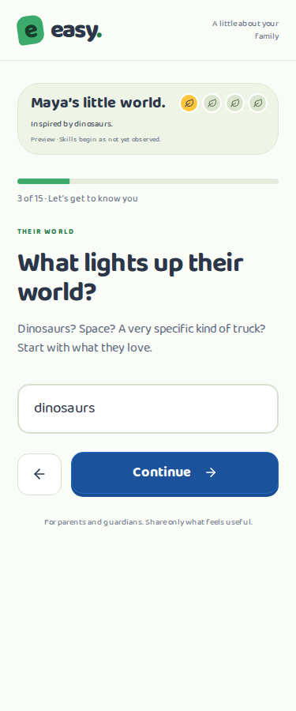

# Phase 1 — first impression and Roadmap home

This phase implements the approved first-impression rebuild on the existing Next.js / Supabase stack. It is not the completed production MVP.

## What changed

- Restored Baloo 2 and Palette B, with darker action/text variants where the base blue and green do not provide sufficient contrast for small text. Added an original SVG trail-guide illustration; no stock or borrowed characters.
- Rebuilt the public homepage in the brief's order: navigation, interactive hero, problem, lesson-generation steps, Night 1/8/20 story, Roadmap, differentiation, questions, pricing positioning, and footer.
- Added three explicitly pre-authored sample experiences. The demo has no authentication requirement, personal-input fields, or model calls. Sample progress is labeled illustrative.
- Replaced the card-heavy dashboard with the learning map, math/reading selection, a selected-skill explanation, and one main activity-preparation action. Existing history and tools remain available.
- The dashboard uses stored observations and a deterministic starting point rather than waiting on model calls on every page load. Database errors surface a retry state instead of an empty progress map.
- Rebuilt onboarding as 15 questions, including optional parent stress and teaching analogy questions. Answers persist when moving backward; existing fields outside the shortened questionnaire are preserved. The parent goes straight to the Roadmap after a successful save.
- Added a progressively revealed onboarding path and scroll-driven story motion with a static reduced-motion version. Text stays readable throughout transitions.
- Updated public copy and metadata to the locked framing, and changed generated activity duration examples to 15–20 minutes.
- Added browser tests and reproducible local Lighthouse measurement tooling. No new client-side UI dependency was added; Playwright, axe, and Lighthouse are development dependencies only.

## Verification

The tests use a production build, synthetic parent/child records, and a local fixture service. They do not use real family data or invoke Anthropic.

- Production build: passed.
- TypeScript check: passed.
- ESLint: passed.
- Six Playwright tests: passed.
- Homepage, onboarding, and Roadmap: exercised at 375px and 1280px, both default and reduced motion.
- axe WCAG A/AA checks: no reported violations on those tested screens.
- Covered: changing sample interests, opening/closing the briefing, required answers, previous-answer retention, profile save, optional-question skipping, save-error retry, preservation of old profile fields, math/reading switching, keyboard node selection, and unauthenticated redirects.
- Screenshots were inspected for layout and overflow. No horizontal overflow was detected at the tested widths.

Lighthouse 13.5 / Chromium 153 local production-build measurements, using the standard simulated mobile configuration and the desktop configuration. These are laboratory results, not production field measurements.

| Configuration | Performance | Accessibility | LCP | CLS |
|---|---:|---:|---:|---:|
| Mobile | 97 | 100 | 2.512 s | 0.000 |
| Desktop | 100 | 100 | 0.558 s | 0.000 |

Mobile LCP is approximately 2.5 seconds and narrowly exceeds the under-2.5-second target. Remaining diagnostics include unused framework JavaScript and render-blocking styles/fonts; production measurements are still needed. No zero-risk or full WCAG-conformance claim is implied by an automated score.

To repeat: `PLAYWRIGHT_CHROMIUM_EXECUTABLE_PATH=/path/to/chromium node tests/measure-homepage.mjs` after the documented fixture build. Omit the environment variable if Playwright's normal Chromium is installed. JSON reports are written to ignored `test-results/` files.

## Screenshots

These use synthetic example data. Full-size screenshot sets are generated by `npm run test:e2e`; selected crops are included here for review.

## Boundaries and remaining decisions

- No production deployment, database changes, or standards seeding was performed. No existing repository files were deleted or archived.
- The provisional standards reference remains clearly labeled. Its official California framework, per-row source verification, checkpoint pacing, and track-state calculation await Phase 2. The app does not newly claim California alignment.
- Production authentication, database ownership isolation, email delivery, and real AI responses were not verified. Existing SQL policies were inspected during the audit; browser fixtures cannot establish their effectiveness.
- Parent approval is not yet persisted server-side. The legacy `/kid` route remains a known gap; the required approval gate and static child output belong to Phase 3 and must be completed before real-family rollout.
- Immersive session mode, curriculum-linked reward persistence, weekly recaps, and release analytics belong to later phases. Session-mode Lighthouse measurements are deferred until that mode exists.
- Existing writing and book-discovery functionality remains in legacy routes, rather than being deleted during a visual phase. New Roadmap home shows math and reading only.
- The source prototypes named in the brief are absent from this repository. The specified homepage sequence was reconstructed in React without introducing GSAP or another animation dependency.

Next gate from the supplied brief: approve Phase 2 and decide which official California framework and how many checkpoints to use. Do not seed standards before that decision.
